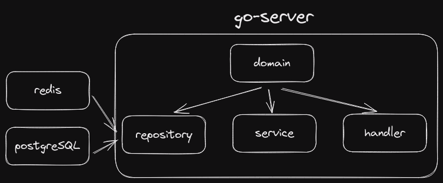

# Simple Ad Service (SADs 😢)

This is a simple backend service which can create and get ads.

### Quick Start

```sh
# Clone the repo
git clone https://github.com/huhuhu0420/simple-ad-service
# Change directory
cd simple-ad-service
# Copy env file
cp example.env .env
# Start the service
docker-compose up
```

There're three containers will be created: Golang for the server, postgreSQL for the database, and Redis for the cache.

Database will be initialized with some data, you can check the data in `sql/*.sql`.

Go to http://localhost:5000/swagger/index.html can see swagger api document.

### Project Explanation

#### Project Structure



#### Golang Server

The server is built with Golang, and it uses `gin` as the web framework. The server provides two APIs:

`/ad POST`: create an ad
- the request body should be a JSON object, and the JSON object should contain the following fields:
  - title: string
  - startAt: string (in the format of "YYYY-MM-DD")
  - endAr: string (in the format of "YYYY-MM-DD")
  - conditions: object (optional)
    - ageStart: int
    - ageEnd: int
    - country: array of string
    - gender: array of string
    - platform: array of string

`/ad GET`: get conditions matched ads
- the request query supports the following fields:
    - Age: int
    - Country: string
    - Gender: string
    - Platform: string

The project stucture follows the clean architecture, and the main components are:
- `ads/handler`: contains the API handlers
- `ads/service`: contains the business logic
- `ads/repository`: contains the data access logic
- `domain`: contains the data models
- `db`: contains the database connection

Using `pgx` as the database driver, and `pgpool` as the connection pool.

#### Database

The database is built with postgreSQL, and it contains six tables:
- `ads`: contains the ad information, including the ad id, ad title, start date and end date
- `ad_ages`: contains the ad age information
- `ad_genders`: contains the ad gender information
- `ad_platforms`: contains the ad platform information
- `ad_countries`: contains the ad country information
- `countries`: contains country code in ISO 3166-1 alpha-2


#### Cache

Though I implemented the cache feature, there's a issue mentioned in [issue](#improvement).

The cache is built with Redis, and it caches the query for key and the response for value.

### Testing

The project contains unit tests and API tests, both of them will be run in github actions

unit tests is built with go test, and it can be run with the following command:
```sh
go test -v ./...
```

API tests is built with postman collection, and test with newman in github actions.

### k8s

The project contains k8s deployment files, and it can be deployed to GKE.

K8s deployment files:
- `go-server-deployment.yaml`: the deployment file for the Golang server
- `go-server-service.yaml`: the service file for the Golang server
- `ingress.yaml`: the ingress file for the Golang server
- `postgres-db-deployment.yaml`: the deployment file for the postgreSQL
- `postgres-db-service.yaml`: the service file for the postgreSQL
- `postgres-db-pvc.yaml`: the persistent volume claim file for the postgreSQL
- `postgres-db-pv.yaml`: the persistent volume file for the postgreSQL

### CI/CD
tools: github actions
- lint: using golangci-lint
- test: using go test for unit test
- build: using docker-compose
- api test: using newman
- deploy: deploy to GKE

### Improvement

#### Cache
In my opinion, I believe that cache technology is not suitable for this project. This is because the data is updated too frequently, leading to frequent cache invalidation. Furthermore, the complexity of the query conditions makes it easy to encounter cache misses.